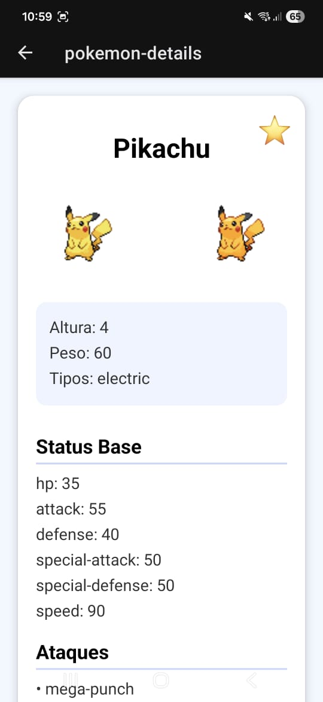

# Trabalho Final – Aplicativo Mobile com Consumo de API

**Aluno:** Gabriel Ramos Corrêa  
**Tecnologia:** React Native + Expo  
**Tema:** Pokédex Interativa

## 1. Objetivo

Desenvolver um aplicativo mobile utilizando React Native com Expo que consuma **uma API real** (PokéAPI) por meio de requisições HTTP, exibindo os dados retornados na tela de forma interativa e organizada.

## 2. Descrição Geral do Projeto

O aplicativo **PokéMatrix App** permite ao usuário:

- Buscar Pokémons pelo nome.
- Visualizar detalhes de cada Pokémon (sprites, tipos, status, ataques).
- Favoritar Pokémons capturados.
- Editar informações do perfil do treinador (nome, avatar, clã).
- Navegar entre páginas de Pokémons com botões “Próxima Página” e “Página Anterior”.
- Filtrar Pokémons por pesquisa (ponto extra).

A interface é organizada em **abas**, com destaque para a **Pokedex** e **Perfil**, e usa cores predominantes do universo Pokémon (`#006EFF`).

## 3. Requisitos Obrigatórios

### 3.1 Tecnológicos

| Requisito | Como foi atendido |
|------------|-----------------|
| React Native com Expo | O projeto foi criado usando Expo e React Native, garantindo compatibilidade mobile e web. |
| useState | Todos os estados dinâmicos (nome, avatar, favoritos, página da lista, dados do Pokémon) usam `useState`. |
| useEffect para requisição | O carregamento de dados da PokéAPI é feito com `useEffect` na tela de detalhes do Pokémon e na listagem da Pokedex. |
| fetch ou axios | O consumo da API foi feito com `fetch` diretamente para `https://pokeapi.co/api/v2/pokemon/{name}`. |

### 3.2 Funcionais

| Requisito | Como foi atendido |
|------------|-----------------|
| Requisição HTTP real | Requisição real à PokéAPI para buscar informações do Pokémon e exibir na tela. |
| Exibir dados na tela | Sprites, tipos, altura, peso, status e ataques são exibidos em cards na tela de detalhes e na Pokedex. |
| Tratar carregamento | Tela de carregamento com `<ActivityIndicator>` e texto “Carregando detalhes...”. |
| Tratar erros | Try/catch no fetch exibe mensagem de erro no console e evita travamentos. |
| Listagem de dados | Pokémons capturados são exibidos em **FlatList** com cards contendo sprite e nome. |
| Botões de navegação | Botões “Próxima Página” e “Página Anterior” na tela de perfil para navegar entre Pokémons capturados. |

## 4. Pontos Extras

- **Filtro de busca:** Campo de pesquisa na Pokedex para filtrar Pokémons já carregados pelo nome. Caso não esteja na lista, é possível buscar diretamente com o botão de busca ao lado.
- **Interface personalizável:** Tabs e headers personalizados com cores e ícones Pokémon.
- **Favoritos interativos:** Possibilidade de favoritar/desfavoritar Pokémons com estrela ⭐.

## 5. Screenshots do App
  
  
 
  
  
  
 